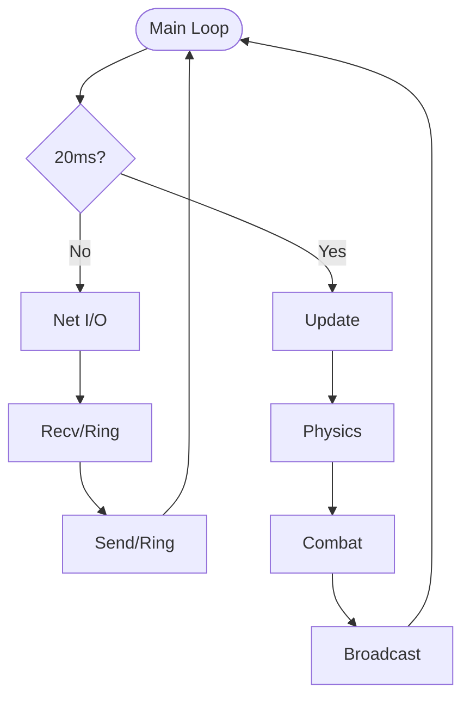

# 실시간 다수 연결 게임 서버 포트폴리오 — 김민성

### 다수의 연결을 안전하게 **받고 · 검증하고 · 반영하다**

> **네오플 [던전앤파이터] 서버 프로그래머 지원** · minsung1008@naver.com
>
> `#하루_1kg` — 티 안 나도 매일 쌓아 한계를 넘는 사람

---

## 목차

1. [About](#about)
2. [[P1] 실시간 다수 연결 게임 서버 (TCPFighter)](#p1-실시간-다수-연결-게임-서버--tcpfighter) — **코드 공개**
3. [[P2] 경로 탐색 (A\* / JPS)](#p2-경로-탐색-a--jps) — **코드 공개**
4. [[P3] 학습 중인 영역 — 서버 코어와 비동기](#p3-학습-중인-영역--서버-코어와-비동기)
5. [마무리](#마무리)

> **P1·P2는 제가 직접 구현한 코드를 이 저장소에 공개했습니다.** P3는 아직 학습 단계라 별도로 구분해 적었습니다.

---

## About

**다수 클라이언트의 상태를 실시간으로 받아 검증하고 전체에 일관되게 반영하는 서버를, 라이브러리에 기대지 않고 바닥부터 직접 구현했습니다.**

| 분류 | 스택 | 상태 |
|---|---|---|
| 언어 | C / C++17 | 구현 |
| 네트워크 | TCP 스트림 · Non-blocking Socket · select 멀티플렉싱 | 구현 |
| 자료구조 | 링버퍼 · 경로 탐색(**A\***, **JPS**) · 레드블랙 트리 | 구현 |
| 비동기 | WSAAsyncSelect · IOCP | 학습 중 |
| 동시성 | 메모리 풀 · 참조 카운팅 · RW Lock · 데드락 검출 | 학습 중 |
| 도구 | Visual Studio · Git · Wireshark(패킷 분석) | — |

> **학습 철학**: 개념은 *직접 구현*으로 체화하고, 버그는 *근본 원인까지 추적*해 끝을 봅니다.

---

## [P1] 실시간 다수 연결 게임 서버 — TCPFighter

**다수 클라이언트의 상태를 동시에 받아 검증하고 전체에 반영하는 실시간 대전 게임 서버 (1인 단독 구현)**

📂 **소스 코드**: [`/TCPFighter_Server`](./TCPFighter_Server) — 메인 로직(`main.cpp`) · 링버퍼(`RingBuffer.h/cpp`) 전체 공개
*(패킷 프로토콜 정의 헤더는 교육기관 제공 자료라 저작권을 존중해 제외)*

| 항목 | 상세 내용 |
|:---:|---|
| **설명** | 8방향 이동 및 3종 공격이 가능한 실시간 2D 대전 게임 서버 |
| **개발 인원** | 1인 (서버 전체 단독 구현) |
| **개발 환경** | C++, WinSock2 (Windows), Non-blocking Socket |
| **핵심 기술** | select() 멀티플렉싱, 링버퍼, 패킷 직렬화/프레이밍, 서버 권위 검증 |

### 핵심 결과

- 🟢 클라이언트 보고 좌표를 **서버가 검증 후 반영** — 오차 50px 초과 시 재동기화
- 🟢 select 상시 리턴으로 **CPU 100%** 치솟던 문제 → 송신 대기 세션만 감시하도록 최적화해 해소
- 🟢 재현되던 **접속 종료 크래시를 구조 개선으로 제거** (지연 삭제)

### 시스템 아키텍처

네트워크와 로직이 분리된 수직 구조입니다.



### 핵심 의사결정

**1. 서버 권위(Server-Authoritative) 검증 — 보고된 값을 그대로 믿지 않는다**
- 이동·공격 판정을 전부 서버가 수행. 클라이언트 보고 좌표가 서버 추적 좌표와 **50px(`dfERROR_RANGE`) 이상** 벌어지면 재동기화해 누적 오차로 인한 영구 어긋남 차단
- 패킷 헤더에 매직 넘버(`0x89`)를 두어 손상·비정상 패킷은 세션 종료로 격리 (`main.cpp:495`)

**2. 링버퍼 직접 구현 — 복사 없는 수신 경로**
- 가용 공간 포인터를 `recv()`에 직접 전달해 **중간 복사 없이** 적재 (`DirectEnqueueSize`)
- 경계 없는 TCP 스트림에서 Header Peek → Length Check → Dequeue로 패킷 프레이밍

**3. select 운용 최적화 — CPU 100% 해소**
- 전 세션을 `WriteSet`에 상시 등록하면 항상 "쓰기 가능" 상태라 `select()`가 즉시 리턴을 반복 → CPU 점유율 100%
- **송신 큐에 데이터가 있는 세션만 등록**하도록 변경해 해소 (`main.cpp:332`)
  ```cpp
  FD_SET(pSession->Socket, &ReadSet);
  if (pSession->Sendq.GetUseSize() > 0)
      FD_SET(pSession->Socket, &WriteSet);
  ```

**4. 논블로킹 송신의 부분 전송 처리**
- `send()`가 요청한 만큼 다 보내지 못하는 경우를 전제로, 보낸 만큼만 링버퍼에서 제거
- `WSAEWOULDBLOCK`은 오류가 아닌 **정상 분기**로 처리 (`main.cpp:468, 535`)

### 트러블슈팅 — 접속 종료 시 발생하는 크래시

```
증상   클라이언트 여러 개를 붙이고 접속/종료를 반복하면 서버 크래시
       재현이 일정하지 않고, 죽는 위치도 매번 다름
  │
가설   소켓 문제로 의심 → recv/send 반환값과 WSAGetLastError 전수 확인
       ──▶ ❌ 값은 모두 정상
  │
전환   죽는 '순간'이 아니라 죽기 '직전'의 흐름을 기록해 비교
  │
발견   공통점: 항상 누군가 접속을 끊은 직후
  │
원인   수신 처리 도중 끊긴 세션을 그 자리에서 delete + 목록에서 erase
       → 그 목록은 바로 그 순간 순회 중 → 반복자 무효화 → 해제된 메모리 접근
  │
해결   삭제 시점을 순회에서 분리 — '지연 삭제(Deferred Delete)'
       ① 세션에 bIsAlive 플래그만 내림          (main.cpp:830)
       ② 실제 정리는 다음 프레임 최상단에서 일괄  (main.cpp:310~321)
       ③ 종료가 여러 경로에서 중복 호출되지 않게 진입부 가드
```

**배운 점** — 크래시가 난 줄과 원인이 있는 줄은 서로 다른 함수에 있었습니다. 스택만 봐서는 끝까지 보이지 않았고, **객체의 수명과 그 객체를 참조하는 코드의 구간을 따로 떼어 보는 것**이 원인에 닿는 길이었습니다.

**던전앤파이터 서버와의 연결** — 공고의 *라이브 이슈 대응*과 *서버 최적화·리팩토링*이 여기에 닿습니다. 재현되지 않는 이슈를 로그와 코드 흐름만으로 좁히는 일, 그리고 동작은 하지만 자원을 낭비하는 구조를 찾아 고치는 일을 작은 규모로나마 직접 겪었습니다.

---

## [P2] 경로 탐색 (A\* / JPS)

**격자 위에서 최단 경로를 계산하고, 탐색 노드 수를 줄이는 최적화까지 직접 구현**

📂 **소스 코드**: [`/Pathfinding`](./Pathfinding) — A\*(`AStar/main.cpp`) · JPS(`JPS/JPS.h`, `JPS.cpp`) · 시각화(`JPS/Render.cpp`)

**문제** — A\*는 개방된 격자에서 대칭적인 중복 경로를 모두 평가하느라 탐색 노드가 폭발합니다.

**해결** — JPS(Jump Point Search)로 직선·대각 방향으로 '점프'하며 **분기점만 평가**해 중복 경로를 가지치기했습니다.

**난관** — 강제 이웃(forced neighbor) 판정과 점프 규칙을 격자 경계·장애물 상황에서 정확히 구현하는 것이었습니다. 규칙이 조금만 어긋나도 경로가 장애물을 뚫거나 최단이 아닌 경로가 나오는데, 이게 어느 케이스에서 깨지는지 로그로는 보이지 않았습니다. 그래서 **탐색 과정을 화면에 직접 그려(`Render.cpp`) 눈으로 확인하며** 케이스를 하나씩 잡았습니다.

**던전앤파이터 서버와의 연결** — 공고 자격 요건의 *자료구조·알고리즘에 대한 이해*에 해당합니다. 라이브러리를 쓰지 않고 우선순위 큐 운용, 휴리스틱 설계, 노드 상태 관리를 직접 다뤘습니다.

---

## [P3] 학습 중인 영역 — 서버 코어와 비동기

> **여기는 아직 제 손으로 처음부터 설계한 단계가 아니라, 강의를 교재 삼아 따라 구현하며 원리를 익히고 있는 영역입니다.** 완성된 것과 학습 중인 것을 구분해 적습니다.

select 단일 스레드 구조로는 동시 접속이 늘었을 때 감당하지 못한다는 것을 P1에서 직접 확인했고, 그 다음 단계를 학습하고 있습니다.

- **입출력 모델의 진화** — Select → WSAAsyncSelect → IOCP를 순서대로 따라 구현하며 "왜 다음 모델이 필요한가"를 코드로 확인
- **비동기 작업의 생명주기** — 작업 요청과 완료 시점이 분리되면서 생기는 문제. 작업 직전 참조 카운트를 올리고 완료·실패 시 내려 사용 중 객체의 소멸을 차단
- **종료 중복 방지** — 접속 종료가 두 번 처리되지 않도록 원자적 플래그로 단 한 번만 통과
- **동시성 기반** — 크기 구간별 메모리 풀, 재진입 RW Lock(32비트 정수에 `상위 16b = 쓰기 소유 스레드` / `하위 16b = 읽기 카운트` 비트 패킹)
- **데드락 검출** — 락 획득 순서를 방향 그래프로 누적하고 DFS로 순환 고리를 탐지해, 재현이 어려운 교착을 실행 중 경고 대상으로 전환

**아직 코드로 남기지 못한 것** — 데이터베이스 연동은 학습과 구현 모두 아직입니다. 정보처리기사를 준비하며 SQL을 다뤄 본 수준이고, 서버에 붙여 본 경험은 없습니다. 지원 직무에서 필요한 부분이라 솔직히 적습니다.

---

## 마무리

| 던전앤파이터 서버의 업무 | 이 저장소에서 증명한 것 |
| --- | --- |
| 다수 클라이언트 상태 수신·검증·반영 | **[P1]** 서버 권위 검증 · 링버퍼 · 패킷 프레이밍 |
| 라이브 이슈 대응 (디버깅·이슈 추적) | **[P1]** 반복자 무효화 크래시 추적 → 지연 삭제 |
| 서버 최적화 | **[P1]** select CPU 100% → 조건부 `WriteSet` 등록 |
| 자료구조·알고리즘 | **[P2]** A\* / JPS 직접 구현 |
| 비동기 프로그래밍 | **[P3]** 학습 중 |

동작하는 코드와 신뢰할 수 있는 코드는 다르다는 것을 P1에서 배웠습니다.
증상이 아니라 **원인에 닿을 때까지 따라가는 것**이 그 차이를 만든다고 생각합니다.

> 운동에서 매일 1kg을 더 들어 한계를 넘었듯, **끝까지 쌓아 올리는 끈기**로 배우고 책임지겠습니다. `#하루_1kg`
